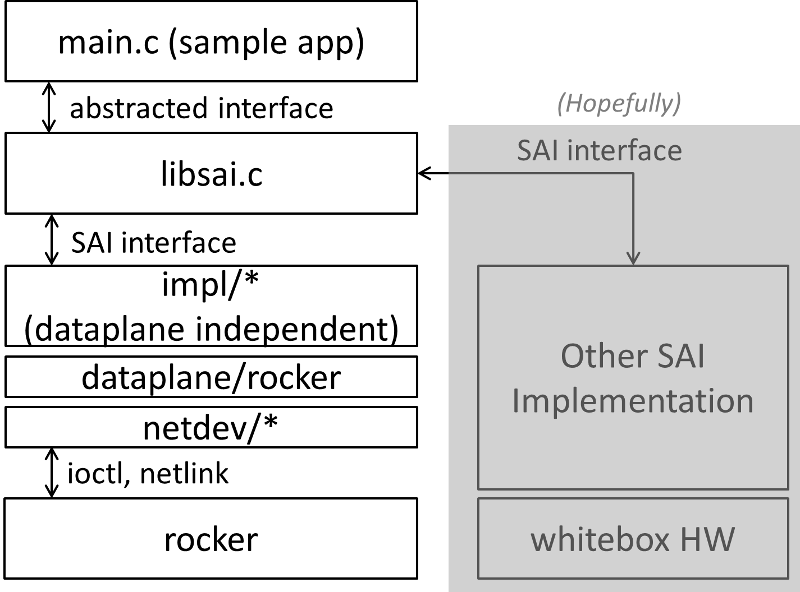

# Overview of the directories and files in the repo

# Files in the "impl" directory
The files in this directory are "dataplane-independent" SAI implmentation, which means that the codes in this directory
- Do general SAI operations such as:
 - Creating a VLAN
 - Adding a port to a VLAN
 - Creating an L3 route
- And then call corresponding rocker specific specific operation funcions.

For example, impl_sai_vlan.c:impl_create_vlan() operates a general data structure for vlan, and then calls `rocker_create_vlan()' at the end of the function.

In order to separate operations into the dataplane-independent SAI layer (this directory) and the dataplane-dependent layer (dataplane/rocker),
some data structures defined in this directory (which of course are dataplane-INdependent) have a pointer to dataplane-DEPENDENT data.
For example, `struct __vlan' in impl_sai_vlan.h is defined as follows:

    struct __vlan{
      sai_vlan_id_t id;
      int number_of_ports;
      sai_vlan_port_t* port_list;
      
      // data plane specific members should be capseralized here
      void* data_plane_attributes;
    };

Here `id`, `number_of_ports`, and `port_list` are dataplane-independent data and the void* at the tail is the pointer to the dataplane-dependent part of the vlan data structure (we do this because there is no inheritance in pure C).
The contents of the void* are stored by the dataplane code, and the code in impl directory must be unaware of them.
If the code in this directory care the contents of the pointer, there must be a bug (or at least a design violation).

# Files in the "dataplane/rocker" directory
The files in this directory are "dataplane-dependent" operations for rocker such as:
- Setting virtual NICs up, because a switch port is assosiated with a virtual NIC inside the guest OS in rocker
- Creating a bridge and assigning an L2 interface to the brdige, because a bridge must exists for every VLAN in rocker

Note that the separation of dataplane-dependent and -independent parts is incomplete.
rocker\_\*.{c,h} are completely separeted from the dataplane-independent SAI part,
but sai_rocker\_\*.{c,h} still include general SAI part (e.g. parameter check) as well.

# Files in the "netdev" directory
The files in this directory are libraries for communicating with the linux networking stack using ioctl interfaces.

## ethtool.c
Functions in this file invoke kernel networking functionalities using "ethtool" ioctl interace.
  - get_port_speed("eth0") is equivalent to a user command "ethtool eth0 | grep Speed"
  - get_driver_info("eth0") is equivalent to a user command "ethtool -i eth0 | grep driver"
  - \_\_ethtool\_init() is called only once to initialize a socket used for ioclt before main() is called.

## netlink.c
Functions in this file invoke kernel networking functionalities using "netlink" ioctl interace.

Useful documents to understand what is done in netlink messasing.
  - http://man7.org/linux/man-pages/man3/rtnetlink.3.html
    "EXAMPLE" section in this page MUST be checked before reading the codes in this directory.
  - Source code of iproute2 user command, especially iproute2/ip/iplink.c:iplink\_modify()

The data structure for a netlink message consists of
  - *the* header `struct nlmsghdr',
  - one payload `struct if****msg' (e.g. ifinfomsg, ifaddrmsg) for the mandatory message, and
  - buffer for optional payloads to be added on demand (char \_[1024] in the code).

Optional payloads are stored into the buffer (named "\_") using add_netlink_msg().
Note that the weird name "\_" means that this buffer must not be accessed by its name directly (like \_[0] = 1 is never supposed to occur), but add_netlink_msg() must be used instead.

# libsai.{c,h}, main.c
These three files implement a sample application using our SAI implementation. The description of the application is in README.md

libsai.{c,h} calls SAI functions and provides more abstracted functionalitieis (e.g. create_new_route), and main.c calls these abstracted functionatilies to implement the sample application.
The ideal case is that libsai.{c,h} work on other SAI implementations (e.g. broadcom SAI) as well (but it's just a hope and not tested).

# linux/linux-image.deb
This is a linux kernel compiled with rocker software switch enabled.

Installing this kernel requires only to execute "dpkg -i linux-image.deb", thanks to debian tools for creating a .deb package of a kernel.
The dpkg command also takes care of the grub setting and kernel module placing, so you really need to care nothing.

The kernel is compiled using the config and the source code of Ubuntu Server 15.04, so the base system to install this kernel must also be Ubuntu Server 15.04.
(Installing this kernel into other versions of Ubuntu or even to other distributions may break the system.)

The difference of this kernel between the original destribution version is that the following configs are enabled to use rocker software switch:
- CONFIG_NET_SWITCHDEV=y
- CONFIG_NET_VENDOR_ROCKER=y
- CONFIG_ROCKER=m